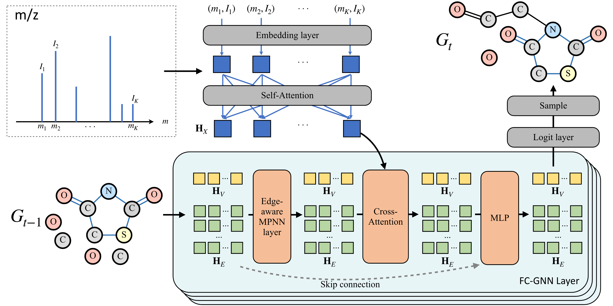

# MADGEN: Mass-Spec attends to De Novo Molecular generation

<a href="https://openreview.net/forum?id=78tc3EiUrN"></a>

Official implementation of [**MADGEN: Mass-Spec attends to De Novo Molecular generation**](https://openreview.net/forum?id=78tc3EiUrN) by Yinkai Wang, Xiaohui Chen, Liping Liu, and Soha Hassoun.



## 📋 Table of Contents

- [Overview](#overview)
- [Environment Setup](#environment-setup)
- [Data Preparation](#data-preparation)
- [Training](#training)
- [Sampling](#sampling)
- [Evaluation](#evaluation)
- [Predictive Retrieval](#predictive-retrieval)
- [Pre-trained Models](#pre-trained-models)
- [Citation](#citation)
- [Contact](#contact)

## 🔬 Overview

MADGEN is a novel approach for de novo molecular generation that leverages mass spectrometry data. The model uses a transformer-based architecture to generate molecular structures from mass spectra, incorporating both molecular and spectral information for improved generation quality.

### Key Features

- **Mass-Spec Guided Generation**: Utilizes mass spectrometry data to guide molecular generation
- **Transformer Architecture**: Leverages state-of-the-art transformer models for sequence generation
- **Multi-Modal Integration**: Combines molecular SMILES and spectral embeddings
- **Comprehensive Evaluation**: Includes both generation and retrieval evaluation metrics

## 🛠 Environment Setup

### Prerequisites

- Python 3.9
- CUDA-compatible GPU (recommended)
- Conda package manager

### Installation

1. **Create conda environment:**
```shell
conda create --name madgen python=3.9 rdkit=2023.09.5 -c conda-forge -y
conda activate madgen
```

2. **Install additional dependencies:**
```shell
pip install -r requirements.txt
```
3. **Verify installation:**
```shell
python -c "import rdkit; print('RDKit version:', rdkit.__version__)"
```

## 📊 Data Preparation

### Available Datasets

The processed datasets are available in our Zenodo repository: [MADGEN Data](https://zenodo.org/records/15036069)

#### MSGym Dataset
```shell
wget https://zenodo.org/records/15036069/files/msgym.pkl?download=1 -O ./data/msgym/raw/msgym.pkl
```

#### CANOPUS Dataset
```shell
wget https://zenodo.org/records/15036069/files/canopus.pkl?download=1 -O ./data/canopus/raw/canopus.pkl
```

#### NIST Dataset
The NIST dataset is commercially available and requires separate licensing. Please refer to the [NIST website](https://www.nist.gov/) for acquisition details.

### Data Structure

Each dataset contains:
- **Molecular SMILES**: Canonical SMILES representations
- **Mass Spectra**: Preprocessed spectral data
- **Molecular Properties**: Additional molecular descriptors
- **Train/Validation/Test Splits**: Predefined data splits

## 🚀 Training

### Basic Training Command

```shell
python train.py --config configs/{dataset_name}.yaml --model Madgen
```

### Available Configurations

- `configs/msgym.yaml` - MSGym dataset configuration
- `configs/canopus.yaml` - CANOPUS dataset configuration
- `configs/nist.yaml` - NIST dataset configuration

### Training Parameters

Key training parameters can be modified in the respective YAML configuration files:

- `batch_size`: Training batch size
- `learning_rate`: Learning rate for optimization
- `num_epochs`: Number of training epochs
- `model_dim`: Model dimension
- `num_layers`: Number of transformer layers

### Example Training Session

```shell
# Train on MSGym dataset
python train.py --config configs/msgym.yaml --model Madgen

# Train on CANOPUS dataset with custom parameters
python train.py --config configs/canopus.yaml --model Madgen --batch_size 32 --learning_rate 1e-4
```

## 🎯 Sampling

### Basic Sampling Command

```shell
CUDA_VISIBLE_DEVICES=1 python sample.py \
    --config configs/{dataset_name}.yaml \
    --checkpoint {checkpoint_path} \
    --samples samples \
    --model Madgen \
    --mode test \
    --n_samples 50 \
    --n_steps 100 \
    --table_name {table_name} \
    --sampling_seed 42
```

### Sampling Parameters

- `--n_samples`: Number of molecules to generate
- `--n_steps`: Number of sampling steps
- `--sampling_seed`: Random seed for reproducibility
- `--mode`: Sampling mode (test/validation)
- `--table_name`: Output table name for results

### Example Sampling Sessions

```shell
# Generate 100 molecules with 200 steps
python sample.py \
    --config configs/msgym.yaml \
    --checkpoint checkpoints/msgym_best.pt \
    --n_samples 100 \
    --n_steps 200 \
    --table_name msgym_generation

# Generate molecules with different seeds for diversity
python sample.py \
    --config configs/canopus.yaml \
    --checkpoint checkpoints/canopus_best.pt \
    --n_samples 50 \
    --sampling_seed 123 \
    --table_name canopus_seed123
```

## 📈 Evaluation

### Generation Evaluation

Evaluate the quality of generated molecules:

```shell
python evaluation_generation.py --file_path /path/to/your/csvfile.csv
```

### Evaluation Metrics

The evaluation includes the following metrics:

- **Top-K Accuracy**: Percentage of cases where the true molecule appears in the top-K predictions (based on InChI key matching)
- **Maximum Tanimoto Similarity**: Maximum Tanimoto similarity between the true molecule and top-K predictions using Morgan fingerprints (radius=2, 2048 bits)
- **Scaffold Coverage**: Percentage of cases with valid scaffold predictions (non-disconnected scaffolds)

### Input Data Format

The evaluation script expects a CSV file with the following columns:
- `true`: True SMILES string
- `pred`: Predicted SMILES string (can be repeated for multiple predictions)
- `scaffold`: Scaffold SMILES string

## 🔍 Predictive Retrieval

### Using Pre-computed Results

Download pre-computed retrieval results:

```shell
# MSGym retrieval results
wget https://zenodo.org/records/17115068/files/ranks_msgym_pred.pkl?download=1 -O ./data/msgym/raw/ranks_msgym_pred.pkl

# CANOPUS retrieval results
wget https://zenodo.org/records/17115068/files/ranks_canopus_pred.pkl?download=1 -O ./data/canopus/raw/ranks_canopus_pred.pkl
```

## 📥 Data Download

### Scaffold Retrieval Datasets

Download the required datasets for scaffold retrieval experiments:

```shell
# Create data directories
mkdir -p scaffold_retrieval/data/canopus
mkdir -p scaffold_retrieval/data/massspecgym

# Download CANOPUS dataset
wget https://zenodo.org/records/17115068/files/canopus.zip?download=1 -O scaffold_retrieval/data/canopus.zip
cd scaffold_retrieval/data/canopus
unzip ../canopus.zip
cd ../..

# Download MassSpecGym dataset
wget https://zenodo.org/records/17115068/files/massspecgym.zip?download=1 -O scaffold_retrieval/data/massspecgym.zip
cd scaffold_retrieval/data/massspecgym
unzip ../massspecgym.zip
cd ../..
```

### Dataset Descriptions

- **CANOPUS**: A comprehensive dataset for molecular structure prediction from mass spectrometry data
- **MassSpecGym**: A benchmark dataset for mass spectrometry-based molecular identification


### Running Custom Retrieval

The scaffold_retrieval module provides a comprehensive framework for molecular scaffold-based retrieval using mass spectrometry data. This module implements contrastive learning approaches to learn molecular representations and enables retrieval of molecules based on their structural scaffolds.


#### Usage:

1. **Training**: Use the training scripts for different datasets:
   ```shell
   cd scaffold_retrieval/
   python train_msgym.py    # For MassSpecGym dataset
   python train_canopus.py  # For Canopus dataset
   ```


3. **Candidate Ranking**: Generate ranked candidates:
   ```shell
   python cand_rank_msg.py   # For MassSpecGym
   python cand_rank_canopus.py # For Canopus
   ```

#### Configuration:
Modify `params_msg.yaml` or `params_canopus.yaml` to adjust model parameters, dataset settings, and training configurations.

Then,
```shell
cd data/msgym/raw/ # Or data/canopus/raw/
python preprocess_rank.py
```

## 🏆 Pre-trained Models

Pre-trained model checkpoints are available at: [MADGEN Checkpoints](https://zenodo.org/records/17115068)

### Available Checkpoints

- **MSGym Model**: Trained on MSGym dataset
- **CANOPUS Model**: Trained on CANOPUS dataset


## 📚 Citation

If you find this code useful for your research, please consider citing our paper:

```bibtex
@inproceedings{
    wang2025madgen,
    title={MADGEN: Mass-Spec attends to De Novo Molecular generation},
    author={Yinkai Wang and Xiaohui Chen and Liping Liu and Soha Hassoun},
    booktitle={The Thirteenth International Conference on Learning Representations},
    year={2025},
    url={https://openreview.net/forum?id=78tc3EiUrN}
}
```

## 🤝 Contributing

We welcome contributions! Please feel free to submit issues and pull requests.

## 📄 License

This project is licensed under the MIT License - see the [LICENSE](LICENSE) file for details.

## 📞 Contact

If you have any questions or need assistance, please contact:

- **Yinkai Wang**: yinkai.wang@tufts.edu
- **Soha Hassoun**: soha.hassoun@tufts.edu

## 🙏 Acknowledgments

We thank the developers of RDKit, PyTorch, and other open-source libraries that made this work possible.
